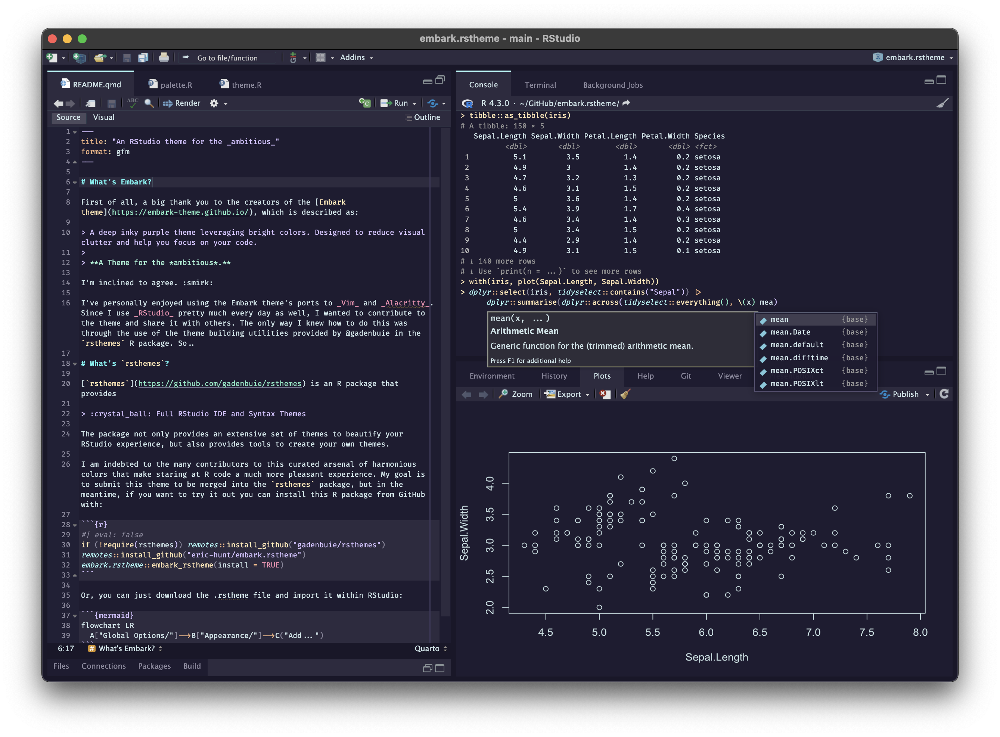
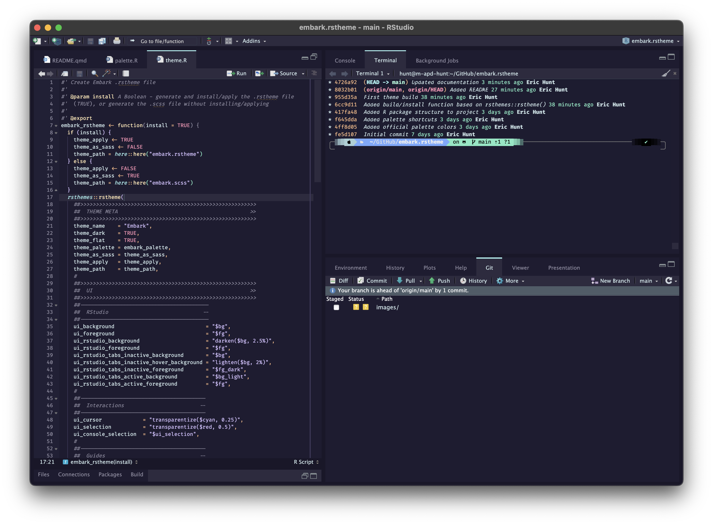
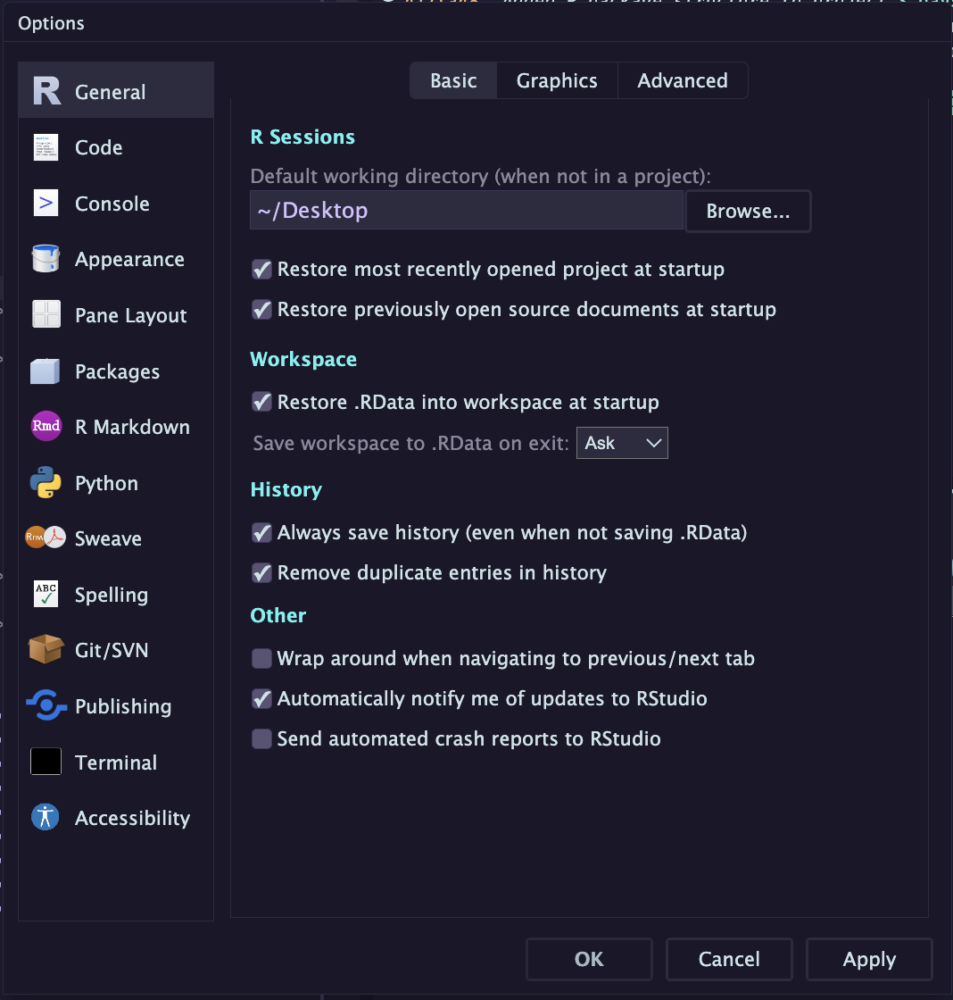
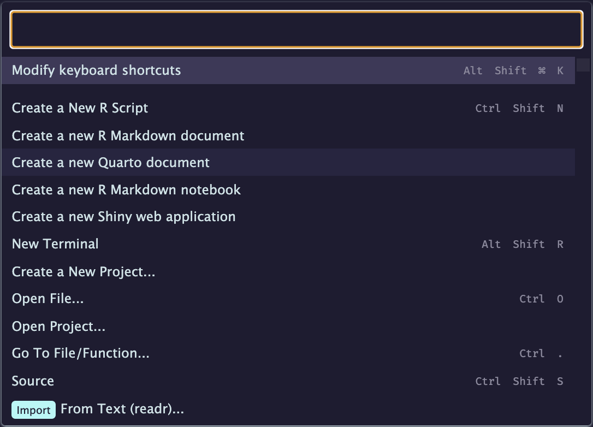

# An RStudio theme for the *ambitious*


<figure>

<figcaption
aria-hidden="true">embark.rstheme_notebook_console</figcaption>
</figure>

<figure>

<figcaption
aria-hidden="true">embark.rstheme_script_terminal</figcaption>
</figure>

<figure>

<figcaption aria-hidden="true">embark.rstheme_dialog</figcaption>
</figure>

<figure>

<figcaption
aria-hidden="true">embark.rstheme_command_palette</figcaption>
</figure>

# What’s Embark?

First of all, a big thank you to the creators of the [Embark
theme](https://embark-theme.github.io/), which is described as:

> A deep inky purple theme leveraging bright colors. Designed to reduce
> visual clutter and help you focus on your code.
>
> **A Theme for the *ambitious*.**

I’m inclined to agree. :smirk:

I’ve personally enjoyed using the Embark theme’s ports to *Vim* and
*Alacritty*. Since I use *RStudio* pretty much every day as well, I
wanted to contribute to the theme and share it with others. The only way
I knew how to do this was through the use of the theme building
utilities provided by @gadenbuie in the `rsthemes` R package. So..

# What’s `rsthemes`?

[`rsthemes`](https://github.com/gadenbuie/rsthemes) is an R package that
provides

> :crystal_ball: Full RStudio IDE and Syntax Themes

The package not only provides an extensive set of themes to beautify
your RStudio experience, but also provides tools to create your own
themes.

I am indebted to the many contributors to this curated arsenal of
harmonious colors that make staring at R code a much more pleasant
experience. My goal is to submit this theme to be merged into the
`rsthemes` package once I get most of the kinks worked out, but in the
meantime, if you want to try it out you can install this R package from
GitHub with:

``` r
if (!require(rsthemes)) remotes::install_github("gadenbuie/rsthemes")
remotes::install_github("eric-hunt/embark.rstheme")
embark.rstheme::embark_rstheme(install = TRUE)
```

Or, you can just download the .rstheme file and import it within
RStudio:


